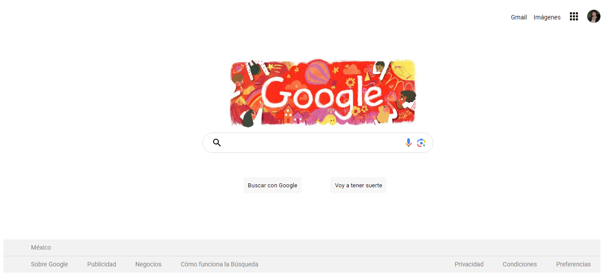

#clon de GOOGLE 

Este proyecto fue creado durante el bootcamp Technolochicas PRO, es un clon de google con la finalidad de comprender parte de HTML y CSS

incluye todas las secciones correspondientes a la pagina de Google. 

Incluye recursos multimedia 

<a href="" target="_blank">**Visitalo ahora** 🚀</a>

#Secciones 

#Tecnologías 

## 📬 Contacto

Si estás interesad@ en compartir o conectar para algún proyecto u oportunidad laboral, contáctame.

<a href="www.linkedin.com/in/fatima-mejia-garcia-2bb21b294"></img></a>

© 2023 Fatima Mejia  (Programa Technolochicas PRO)